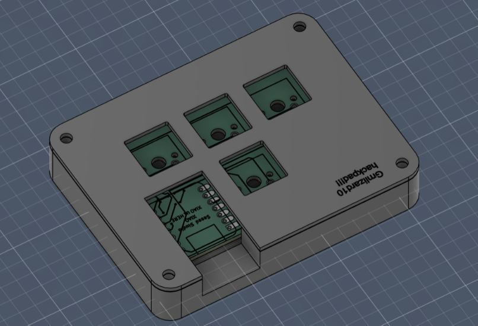
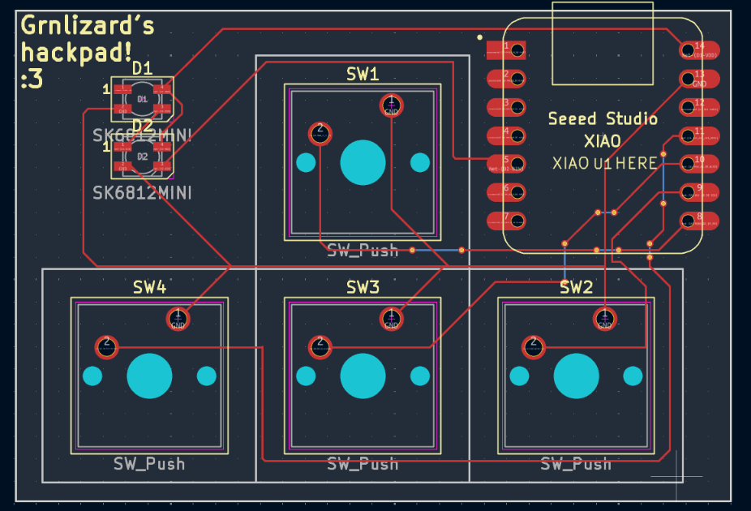
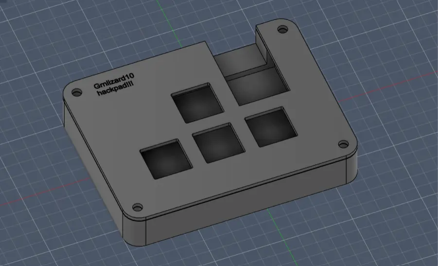

# Grnlizard's hackpad

this is the first macropad i have ever made!!! and i used this [guide](https://web.archive.org/web/20251224215247/https://blueprint.hackclub.com/hackpad/index.md) to make it 

## features 
this macropad has...
4 keys in the regular WASD placement and
two LEDs to light up the insides a little lol 
as my first time making a hackpad i am not sure if the firmware will work but i am hopeful 
and this hackpad was made with my amazing club!!! 

and these are the photos of the case and pcb :D

